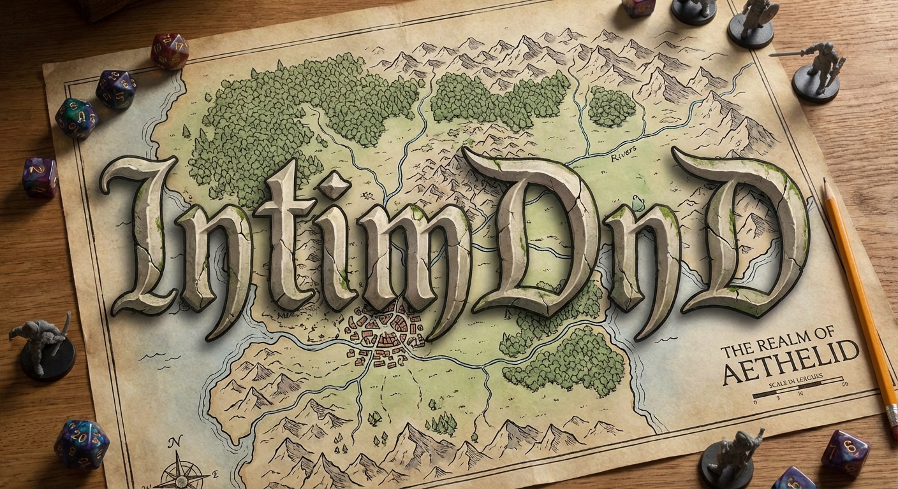

# Interactive & Immersive DnD



Attach any USB webcam to a projector to project an interactive Dungeons and Dragons (or similar) game world onto a table-top surface. Interact with the game using intuitive hand gestures. Generate worlds using generative models.

## Features

- **Hand Tracking**: Uses MediaPipe hand landmarks via Python subprocess
- **Pinch Detection**: Detects thumb-index finger pinch gesture and allows moving characters
- **AI Image Generation**: Generate background images using Google Gemini API

## Prerequisites

- Rust (edition 2021)
- Python 3.10+
- OpenCV
- A webcam
- a top-down HDMI projector or table-top monitor

## Setup

### 1. Create Config Directory and Download the MediaPipe Hand Landmarker Model

```bash
mkdir -p ~/.config/intim-dnd/models
cd ~/.config/intim-dnd/models
wget https://storage.googleapis.com/mediapipe-models/hand_landmarker/hand_landmarker/float16/latest/hand_landmarker.task
```

### 2. Set Up Python Virtual Environment

```bash
python3 -m venv .venv
source .venv/bin/activate
pip install mediapipe numpy
```

### 3. Build and Run

```bash
cargo build --release
cargo run --release
```

### 4. (Optional) Set Up Gemini API for Image Generation

To enable AI background image generation:

1. Get a Gemini API key from [Google AI Studio](https://aistudio.google.com/app/apikey)
2. Create the token file:

   ```bash
   echo "YOUR_API_KEY_HERE" > ~/.config/intim-dnd/gemini_api_token.txt
   ```

### 5. (Optional) Add Character Tokens

Place character token images in `~/.config/intim-dnd/token_reps/` and create a characters config:

```bash
mkdir -p ~/.config/intim-dnd/token_reps
# Add your token images here (e.g., fighter.png, wizard.png)
```

Create `~/.config/intim-dnd/characters.yaml`:

```yaml
characters:
  - name: "Fighter"
    class: "Fighter"
    armor_class: 16
    hit_points: 45
    health: 45
    token_representation: "fighter.png"
    weapons: []
    current_weapon: "sword"
```

## Usage

### Calibration

Click "Start Calibration" to begin the camera-projector calibration process. A dot will appear on the projector - position your camera to see it and the system will automatically detect the correspondence points.
Once calibrated, the application will track your hand and map the index finger tip position to projector coordinates.

### Image Generation

Open the Options window (View → Options Window) and use the Image Generation panel to generate AI backgrounds using Gemini.

### Moving Characters

Use a pinch gesture (thumb and index finger together) to pick up and move character tokens on the grid.

## Files

- `src/main.rs` - Main application with GUI and camera capture
- `src/hand_tracker.rs` - Hand tracking module using MediaPipe via Python subprocess
- `hand_detect.py` - Python script for MediaPipe hand landmark detection

## Configuration

Configuration files are stored in `~/.config/intim-dnd/`:

- `homography.txt` - Camera-to-projector transformation matrix
- `camera_roi.txt` - Region of interest for hand detection
- `gemini_api_token.txt` - Gemini API token for image generation (optional)
- `characters.yaml` - Character definitions
- `models/hand_landmarker.task` - MediaPipe hand landmarker model
- `token_reps/` - Character token images
- `generated/` - AI-generated background images
